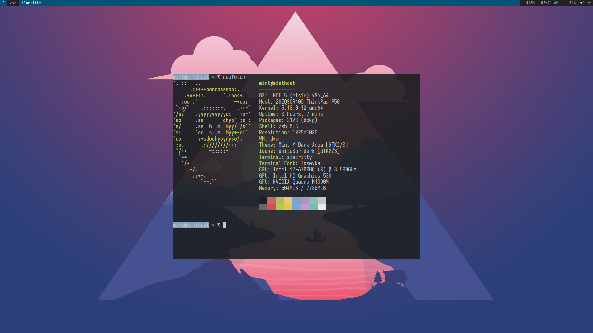

# dwm-mint
Yesterday on July 5, 2022. I bought a new ThinkPad P50. This is my second Thinkpad after using Thinkpad X220 for years.

As always I want to install linux on it. So for the first Linux I tried for this laptop is Linux Mint Debian edition.

And here is my cool DWN Setup on Linux Mint setup for Thinkpad P50.

Setup info just the same with [POPOs dwm repo](https://github.com/rafimrfdn/dwm-popos). 

The difference is in the function whre I put different Patches and newest version.
